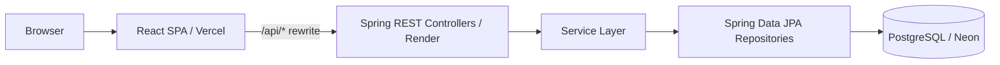

# CourseHub — คอร์สดีบอกต่อ

**ระบบค้นหาและแนะนำคอร์สเรียนออนไลน์ · กลุ่ม 36 · SEC.1**

รายวิชา **CP353002 Principles of Software Design and Development**

CourseHub รวบรวมข้อมูลคอร์สจากหลายแพลตฟอร์ม เพื่อช่วยผู้เรียนค้นหาและเลือกคอร์สตามหมวดหมู่ ระดับ ภาษา งบประมาณ และเวลาที่มี พร้อมบันทึกคอร์ส อ่านหรือเขียนรีวิว และรับคำแนะนำจาก Course Matcher ผู้ให้บริการจัดการข้อมูลสถาบัน ทีมงาน และคอร์สได้ ส่วนผู้ดูแลระบบตรวจสอบคอร์ส ผู้ให้บริการ และรีวิวก่อนเผยแพร่

**เข้าใช้งาน:** [group36-coursehub.vercel.app](https://group36-coursehub.vercel.app/)

**เอกสาร API:** [Swagger UI](https://coursehub-backend-ahz2.onrender.com/swagger-ui.html) · [OpenAPI JSON](https://coursehub-backend-ahz2.onrender.com/v3/api-docs)

ระบบเป็นตัวกลางสำหรับค้นหาและแนะนำคอร์ส ผู้เรียนไปเรียนและชำระเงินบนเว็บไซต์ต้นทาง CourseHub ไม่รับชำระเงินหรือให้บริการวิดีโอการเรียนเอง และ Matcher ใช้กฎการกรองกับสูตรคะแนนที่อธิบายได้

## รายชื่อสมาชิกกลุ่ม

| ลำดับ | รหัสนักศึกษา | ชื่อ-นามสกุล | Email | Branch | หน้าที่รับผิดชอบ |
| :---: | :---: | :--- | :--- | :---: | :--- |
<<<<<<< HEAD
| 1 | 673380054-1 | นายภาคิน เมฆสุวรรณ | phakin.m@kkumail.com | phakin_6733800541 | Course Catalog, Matcher Quiz UI, CI/CD Pipeline, UI Design System |
| 2 | 673380072-9 | นายเกียรติศักดิ์ นันทรัตน์ | keattisak.n@kkumail.com | keattisak_6733800729_01 | Provider & Course CRUD, Database Schema (Flyway), Backup / Restore |
| 3 | 673380062-2 | นายศุภวัฒน์ ข่ายทอง | supawat.kh@kkumail.com | supawat_6733800622_01 | Auth / User / Profile, Matcher Strategy, E2E Tests, Team Members UI |
| 4 | 673380064-8 | นายสรวิชญ์ วันเสน | sorawit.wan@kkumail.com | sorawit_6733800648_01 | Admin Moderation, Provider Verification, Review Moderation, Audit Log |
=======
| 1 | 673380054-1 | นายภาคิน เมฆสุวรรณ  | phakin.m@kkumail.com | phakin_6733800541 | Course Catalog, Matcher Quiz UI, CI/CD Pipeline, UI Design System |
| 2 | 673380072-9 | นายเกียรติศักดิ์ นันทรัตน์ | keattisak.n@kkumail.com | keattisak_6733800729_01 | Provider & Course CRUD, Database Schema (Flyway), Backup / Restore |
| 3 | 673380062-2 |  นายศุภวัฒน์ ข่ายทอง | supawat.kh@kkumail.com | supawat_6733800622_01 | Auth / User / Profile, Matcher Strategy, E2E Tests, Team Members UI |
| 4 | 673380064-8 | นายสรวิชญ์ วันเสน | sorawit.wan@kkumail.com | sorawit_6733800648_01 | Admin Moderation, Provider Verification, Review Moderation, Audit Log |
>>>>>>> 9aca8b5db367f217915404f41c7850fa5fbcb394

## ฟีเจอร์หลัก

| ส่วนระบบ | ความสามารถ |
| --- | --- |
| Course Catalog | ค้นหาคอร์ส กรองหมวดหมู่ แพลตฟอร์ม ระดับ ภาษา รูปแบบราคาและช่วงราคา พร้อมเรียงลำดับและแบ่งหน้า |
| Course Matcher | แบบทดสอบ 4 ขั้นตอน แนะนำสูงสุด 3 คอร์ส พร้อมคะแนน เหตุผล และข้อจำกัดเมื่อไม่พบคอร์สที่ตรงเงื่อนไข |
| บัญชีและโปรไฟล์ | สมัครสมาชิก เข้าสู่ระบบ ออกจากระบบ และแก้ไขโปรไฟล์ส่วนตัว |
| Bookmark | บันทึกหรือยกเลิกคอร์สที่สนใจ และดูรายการส่วนตัวที่ยังเผยแพร่อยู่ |
| รีวิว | อ่านรีวิวสาธารณะ ให้คะแนนและเขียนหรือแก้รีวิวของตนเอง รีวิวใหม่หรือที่แก้ไขต้องผ่านการตรวจอีกครั้ง |
| Provider | ลงทะเบียนและจัดการข้อมูลผู้ให้บริการ พร้อมสมาชิกทีมบทบาท `OWNER` และ `EDITOR` |
| Course Management | สร้าง แก้ไข ส่งตรวจ และลบคอร์สร่าง พร้อมราคา หมวดหมู่ และการระบุแพลตฟอร์มจาก URL อัตโนมัติ |
| Admin Moderation | อนุมัติ ขอแก้ไข ระงับ คืนสถานะ หรือเก็บถาวรคอร์ส รับรอง/ระงับผู้ให้บริการ และอนุมัติ/ปฏิเสธรีวิว |
| Audit Log | ผู้ดูแลดูประวัติ กรองประเภท กิจกรรม ผู้กระทำ รายการ และช่วงเวลา พร้อมแบ่งหน้าฝั่งเซิร์ฟเวอร์ |

ผู้เยี่ยมชมดูคอร์ส อ่านรีวิว และใช้ Matcher ได้โดยไม่ต้องเข้าสู่ระบบ บัญชีใหม่มีบทบาท `LEARNER`; สิทธิ์ Provider เกิดจากการเป็นสมาชิกทีมของผู้ให้บริการแต่ละราย ส่วนหน้าผู้ดูแลใช้บทบาท `ADMIN`

### เส้นทางหน้าเว็บ

| เส้นทาง | หน้า | สิทธิ์ |
| --- | --- | --- |
| `/` | หน้าแรก | ทุกคน |
| `/courses` | ค้นหาคอร์ส | ทุกคน |
| `/match` | แบบทดสอบและผลแนะนำ | ทุกคน |
| `/courses/:courseId/reviews` | รีวิวคอร์ส | ทุกคนอ่านได้; ผู้เรียนที่เข้าสู่ระบบเขียนรีวิวได้ |
| `/register`, `/login` | สมัครสมาชิก / เข้าสู่ระบบ | ผู้ที่ยังไม่ได้เข้าสู่ระบบ |
| `/profile`, `/bookmarks` | โปรไฟล์ / คอร์สที่บันทึก | ผู้ใช้ที่เข้าสู่ระบบ |
| `/providers` | ผู้ให้บริการ คอร์ส และสมาชิกทีม | ผู้ใช้ที่เข้าสู่ระบบ; การจัดการขึ้นกับสมาชิกและบทบาทในทีม |
| `/admin` | ตรวจคอร์ส ผู้ให้บริการ และรีวิว | `ADMIN` |
| `/admin/audit-logs` | ประวัติระบบ | `ADMIN` |

### กฎสำคัญของระบบ

- Catalog และ Matcher แสดงเฉพาะคอร์ส `PUBLISHED` จากผู้ให้บริการ `ACTIVE`; คะแนนและรีวิวสาธารณะใช้เฉพาะรีวิว `PUBLISHED`
- Provider ใหม่เป็น `PENDING` และผู้สร้างเป็น `OWNER` โดยอัตโนมัติ ผู้ให้บริการต้องได้รับการรับรองเป็น `ACTIVE` ก่อนส่งคอร์สตรวจ
- `OWNER` และ `EDITOR` จัดการข้อมูล Provider และคอร์สของทีมตนเองได้ การจัดการสมาชิกและลบ Provider เป็นสิทธิ์ของ `OWNER`; ลบ Owner คนสุดท้ายไม่ได้ และลบ Provider ที่ยังมีคอร์สไม่ได้
- คอร์สใหม่เริ่มที่ `DRAFT` การแก้คอร์ส `PUBLISHED` หรือ `PENDING` ทำให้กลับเป็น `DRAFT` เพื่อส่งตรวจใหม่; คอร์ส `SUSPENDED` และ `ARCHIVED` แก้ไขไม่ได้
- ลบคอร์สได้เฉพาะ `DRAFT` ที่ไม่เคยเผยแพร่และไม่มีรีวิว ข้อขัดแย้งทางธุรกิจหรือ version ไม่ตรงตอบ `409 Conflict`
- Matcher กรองหมวดหมู่ ระดับ ภาษา และงบก่อนจัดอันดับ รองรับคอร์สฟรีหรือจ่ายครั้งเดียวที่ทราบราคาเป็น THB ใช้คะแนนด้านงบ เวลา และรีวิว โดยประเมินเวลาเรียนบนเป้าหมาย 4 สัปดาห์ หากไม่พบผลจะอธิบายข้อจำกัดและให้แก้คำตอบ

## เทคโนโลยีที่ใช้

| ส่วน | เทคโนโลยี |
| --- | --- |
| Frontend | React 18, TypeScript 5, Vite 6, React Router 7, Tailwind CSS 3 |
| Backend | Java 21, Spring Boot 3.5.16, Spring MVC, Spring Security, Spring Data JPA/Hibernate, Bean Validation |
| Database | PostgreSQL, Flyway; local Docker ใช้ PostgreSQL 16 และ production ใช้ Neon |
| API Documentation | springdoc-openapi 2.8.5, Swagger UI |
| Metrics | Micrometer สำหรับนับการเปลี่ยนสถานะคอร์สหลัง commit |
| Testing | JUnit 5, Mockito, MockMvc, Testcontainers, Vitest, React Testing Library, Playwright/Chromium |
| Deployment | Docker, Docker Compose, GitHub Actions, Vercel, Render, Neon |

รุ่น dependency และคำสั่ง build อ้างอิงจาก [Backend pom.xml](code/backend/pom.xml), [Frontend package.json](code/frontend/package.json) และ [E2E package.json](test/e2e/package.json)

## สถาปัตยกรรมและการออกแบบ



Backend แยกชั้น **Controller → Service → Repository** โดย Controller รับคำขอและตรวจข้อมูล Service ดูแลสิทธิ์ กฎธุรกิจ และ transaction ส่วน Repository เข้าถึงฐานข้อมูล ใช้ DTO และ Mapper สำหรับข้อมูล API พร้อม Global Exception Handler ที่ตอบข้อผิดพลาดในรูปแบบเดียวกัน

ยืนยันตัวตนด้วย session cookie `JSESSIONID` และ Spring Security คำขอ `POST`, `PUT`, `DELETE` ต้องส่ง CSRF token จาก `GET /api/v1/auth/csrf` ผ่าน header `X-XSRF-TOKEN` ฝั่ง frontend จัดการ cookie และ token ผ่าน API client กลาง และขอ token ใหม่สำหรับแต่ละ mutation

| Design Pattern | การใช้งานจริง |
| --- | --- |
| Strategy | `ScoringStrategy` แยกสูตร `BudgetFitStrategy`, `EffortFitStrategy` และ `ReviewQualityStrategy` ออกจากการกรองและจัดอันดับ |
| State | `CourseWorkflow` และ `CourseWorkflowState` กำหนดคำสั่งที่อนุญาตในแต่ละสถานะของคอร์ส |
| Observer | `CourseEventPublisher` ส่งเหตุการณ์ให้ `CourseMetricsListener` นับ metrics หลัง transaction commit สำเร็จ |

ข้อมูลธุรกิจและ Audit Log บันทึกใน transaction เดียวกัน หากเขียน audit ไม่สำเร็จจะ rollback ส่วน metrics เป็นการติดตามหลัง commit และเริ่มนับใหม่เมื่อ process restart

ดูเหตุผลและหลักฐานที่ [Design Patterns](doc/design-patterns.md), [SOLID Analysis](doc/solid-analysis.md), [Architecture Decisions](doc/decisions/) และ [Diagrams](doc/diagrams/)

## ฐานข้อมูล

ฐานข้อมูลมี **12 ตารางของระบบ** ไม่รวมตารางประวัติ migration ของ Flyway

| กลุ่มข้อมูล | ตาราง |
| --- | --- |
| ผู้ใช้ | `users`, `user_profiles` |
| ผู้ให้บริการและทีม | `providers`, `provider_members` |
| คอร์ส แพลตฟอร์ม และราคา | `courses`, `platforms`, `course_prices` |
| หมวดหมู่ | `categories`, `course_categories` |
| กิจกรรมผู้เรียน | `reviews`, `saved_courses` |
| ประวัติระบบ | `audit_logs` |

ความสัมพันธ์สำคัญคือ `users`–`user_profiles` และ `courses`–`course_prices` แบบ One-to-One, `providers`–`courses` แบบ One-to-Many และคอร์ส–หมวดหมู่แบบ Many-to-Many ผ่าน `course_categories` มี Foreign Key, Unique Constraint, Check Constraint และ Index ตามการใช้งาน รวมถึง `@Version` สำหรับ Provider, Course และ Review

Flyway สร้างและปรับ schema ที่ startup ตาม migration ใน [db/migration](code/backend/src/main/resources/db/migration/):

| Migration | หน้าที่ |
| --- | --- |
| `V1__init_schema.sql` | สร้าง 12 ตารางและ constraints/indexes |
| `V2__seed_initial_data.sql` | เพิ่มข้อมูลตัวอย่างสำหรับคอร์ส ผู้ให้บริการ แพลตฟอร์ม หมวดหมู่ และผู้ใช้ |
| `V3__audit_log_reason.sql` | เพิ่มเหตุผลใน Audit Log และผลตรวจคอร์ส |
| `V4__review_moderation.sql` | เพิ่ม version เหตุผล และ index สำหรับตรวจรีวิว |
| `V5__automatic_course_platforms.sql` | รองรับ URL คอร์สที่ยาวขึ้นและบังคับโดเมนแพลตฟอร์มไม่ซ้ำ |

JPA ใช้ `spring.jpa.hibernate.ddl-auto=validate` เพื่อให้ schema เปลี่ยนผ่าน migration ดูรายละเอียดที่ [ER Diagram](doc/diagrams/er-diagram.png) และ [Data Dictionary](doc/data-dictionary.md)

## โครงสร้างโปรเจกต์

```text
GROUP36_CourseRecommend/
├── code/
│   ├── backend/             # Spring Boot, Maven Wrapper, Dockerfile, Flyway
│   ├── frontend/            # React pages, feature modules, API client, styles
│   └── scripts/db/          # สคริปต์สำรอง กู้คืน และตรวจฐานข้อมูล
├── test/
│   ├── backend/             # Unit, integration และ test resources
│   ├── frontend/            # Vitest / React Testing Library
│   ├── e2e/                 # Playwright และ Docker stack สำหรับทดสอบแยก
│   ├── scripts/             # ทดสอบตัวป้องกันของสคริปต์ฐานข้อมูล
│   └── smoke/               # ตรวจ production ผ่าน HTTP และ browser
├── doc/
│   ├── decisions/           # Architecture Decision Records
│   ├── diagrams/            # ER, class, sequence, activity, state ฯลฯ
│   ├── test-reports/        # รายงานและหลักฐานการทดสอบ
│   └── slide/               # สไลด์นำเสนอ
├── img/                     # โฟลเดอร์เตรียมไว้สำหรับภาพประกอบ
├── .github/workflows/ci.yml # CI และ deployment workflow
├── .env.example             # ตัวอย่างค่าตั้งต้นสำหรับ local
├── docker-compose.yml       # PostgreSQL + backend สำหรับ local
└── README.md
```

## ติดตั้งและรันบนเครื่อง

### สิ่งที่ต้องเตรียม

- Git และ Node.js 22 พร้อม npm ตาม environment ใน CI
- Docker Desktop ที่เปิดใช้งานอยู่และรองรับ Docker Compose
- Java 21 สำหรับรันหรือทดสอบ backend ผ่าน Maven Wrapper บนเครื่อง; การรัน backend ใน Docker ใช้ Java จาก image
- พอร์ต local `5432`, `8080` และ `5173` ต้องพร้อมใช้งาน

### วิธีหลัก: Docker สำหรับฐานข้อมูลและ backend

รันจากโฟลเดอร์ root ของ repository คำสั่งตัวอย่างใช้ PowerShell:

```powershell
Copy-Item .env.example .env
```

แก้ `POSTGRES_PASSWORD` ใน `.env` เป็นรหัสผ่านสำหรับฐานข้อมูล local แล้วเริ่มระบบ:

```powershell
docker compose up --build
```

เปิด terminal อีกหน้าที่ root เพื่อติดตั้งและเริ่ม frontend:

```powershell
npm ci --prefix code/frontend
npm run dev --prefix code/frontend
```

**Docker Compose ปัจจุบันรันเฉพาะ PostgreSQL และ backend** ส่วน frontend รันผ่าน Vite ซึ่ง proxy `/api` ไปยัง `http://localhost:8080`

| บริการ | URL บนเครื่อง |
| --- | --- |
| หน้าเว็บ | [localhost:5173](http://localhost:5173/) |
| Backend liveness | [localhost:8080/api/v1/system/liveness](http://localhost:8080/api/v1/system/liveness) |
| Swagger UI | [localhost:8080/swagger-ui.html](http://localhost:8080/swagger-ui.html) |
| OpenAPI JSON | [localhost:8080/v3/api-docs](http://localhost:8080/v3/api-docs) |

เมื่อเริ่มครั้งแรก Flyway จะสร้าง schema และข้อมูลตัวอย่าง ผู้ใช้สมัครบัญชีใหม่ผ่าน `/register` ได้ ส่วนการทดสอบงานผู้ดูแลต้องใช้บัญชี `ADMIN` ที่ผู้ดูแล environment จัดเตรียมไว้

หยุดบริการด้วย `docker compose down`; ข้อมูล PostgreSQL อยู่ใน named volume `postgres_data` และคงอยู่สำหรับการเปิดรอบถัดไป

### ทางเลือก: รัน backend ผ่าน Maven Wrapper

ใช้ PostgreSQL ที่ติดตั้งบนเครื่องและสร้างฐานข้อมูลว่างตาม `POSTGRES_DB` ใน `.env` หรือเริ่มเฉพาะฐานข้อมูลด้วย `docker compose up -d postgres` จาก root จากนั้นรัน:

```powershell
cd code/backend
.\mvnw.cmd spring-boot:run
```

บน macOS/Linux ใช้ `./mvnw spring-boot:run` แทน Backend อ่าน `.env` ที่ root ผ่าน `spring.config.import` เมื่อรันจาก `code/backend` และยังต้องเปิด frontend ตามขั้นตอนข้างต้น

### ตัวแปรสภาพแวดล้อม

| ตัวแปร | ความหมาย |
| --- | --- |
| `POSTGRES_DB` | ชื่อฐานข้อมูล local; ตัวอย่างคือ `courserecommend` |
| `POSTGRES_USER`, `POSTGRES_PASSWORD` | บัญชีฐานข้อมูลสำหรับ local/Compose |
| `DATABASE_URL` | JDBC URL สำหรับ override การเชื่อมต่อ เช่น `jdbc:postgresql://localhost:5432/courserecommend` |
| `DATABASE_USERNAME`, `DATABASE_PASSWORD` | บัญชีฐานข้อมูลที่มีลำดับสูงกว่าค่า `POSTGRES_*` ใน backend |
| `SESSION_COOKIE_SECURE` | `.env.example` ตั้ง `false` สำหรับ local HTTP; production HTTPS ต้องใช้ `true` ซึ่งเป็นค่าเริ่มต้นของ backend |
| `COURSEHUB_API_TARGET` | เปลี่ยนปลายทาง Vite dev proxy เมื่อ backend ไม่ได้อยู่ที่ `http://localhost:8080` |

ตั้งค่าการเชื่อมต่อ production ผ่าน environment ของ hosting และเก็บ `.env` กับไฟล์ backup นอก Git ถ้าฐานข้อมูลเดิมมีตารางแต่ไม่มี Flyway history ให้ใช้ฐานข้อมูลว่างสำหรับเริ่มใหม่ตาม migration

## REST API

Base path คือ `/api/v1` รายละเอียด payload, response, validation และ HTTP status ดูได้จาก [API Contract](doc/api-contract.md) และ Swagger UI

| ส่วน | Endpoint หลัก |
| --- | --- |
| ระบบและ CSRF | `GET /system/liveness`, `GET /auth/csrf` |
| บัญชีและโปรไฟล์ | `POST /auth/register`, `/auth/login`, `/auth/logout`; `GET /me`; `GET/PUT /me/profile` |
| Catalog | `GET /courses`, `/courses/{id}`, `/catalog/categories`, `/catalog/platforms` |
| Matcher | `POST /course-matches` |
| Bookmark | `GET /me/bookmarks`, `/me/bookmarks/ids`; `PUT/DELETE /me/bookmarks/{courseId}` |
| รีวิว | `GET/POST /courses/{courseId}/reviews`; `GET/PUT /courses/{courseId}/reviews/me` |
| Provider | `POST /providers`; `GET /providers/me`, `/providers/{id}`, `/providers/slug/{slug}`; `PUT/DELETE /providers/{id}` |
| สมาชิกทีม | `GET/POST /providers/{providerId}/members`; `DELETE /providers/{providerId}/members/{memberId}` |
| คอร์สของ Provider | `GET/POST /providers/{providerId}/courses`; `PUT/DELETE /courses/{id}`; `POST /courses/{id}/submissions` |
| Admin | `GET /admin/courses`, `/admin/providers`, `/admin/reviews`; `POST /admin/courses/{id}/moderation-decisions`, `/admin/providers/{id}/verification-decisions`, `/admin/reviews/{id}/moderation-decisions` |
| Audit Log | `GET /admin/audit-logs` |

API ตอบข้อผิดพลาดด้วยฟิลด์ `timestamp`, `status`, `code`, `message`, `path`, `fieldErrors` โดยแยก `400` ข้อมูลไม่ถูกต้อง, `401` ต้องเข้าสู่ระบบ, `403` ไม่มีสิทธิ์/CSRF ไม่ผ่าน, `404` ไม่พบข้อมูล และ `409` ขัดแย้งกับกฎหรือ version ของข้อมูล

## การทดสอบ

### Backend

จาก `code/backend` โดยติดตั้ง Java 21 และเปิด Docker สำหรับ Testcontainers PostgreSQL:

```powershell
.\mvnw.cmd verify
```

บน macOS/Linux ใช้ `./mvnw verify` Maven ค้นชุดทดสอบจาก `test/backend/` ผ่าน build-helper plugin ผล Surefire อยู่ใน `code/backend/target/surefire-reports/` การยืนยัน schema, transaction และ concurrency บน PostgreSQL ต้องตรวจผล integration tests ที่ใช้ Docker ด้วย

### Frontend

จาก root หลังติดตั้ง dependencies:

```powershell
npm test --prefix code/frontend
npm run build --prefix code/frontend
```

Vitest อ่านเทสต์จาก `test/frontend/` ส่วน build ตรวจ TypeScript และสร้าง production bundle ไว้ที่ `code/frontend/dist/`

### End-to-End

จาก root ติดตั้ง Playwright และ Chromium ก่อนรัน:

```powershell
npm ci --prefix code/frontend
npm ci --prefix test/e2e
cd test/e2e
npx playwright install chromium
cd ../..
npm run test:e2e --prefix code/frontend
```

เปิด Docker และเตรียมพอร์ต `18080` กับ `15173` ชุดทดสอบสร้าง PostgreSQL/backend แยกจากฐานข้อมูลที่ใช้งานปกติ ครอบคลุมผู้เรียน Provider และ Admin พร้อมล้าง Docker stack ของรอบนั้นหลังจบ มีคำสั่ง `test:e2e:headed` สำหรับดู browser และ `test:e2e:list` สำหรับดูรายการเทสต์ รายงาน HTML, JSON, JUnit และ diagnostics อยู่ใต้ `test/reports/e2e/`

ตัวป้องกันสคริปต์ฐานข้อมูลทดสอบจาก root ด้วย:

```powershell
.\test\scripts\backup-restore.Tests.ps1
```

ดู [Test Plan](doc/test-plan.md), [คู่มือ E2E](doc/task22-e2e-guide.md) และ [Test Reports](doc/test-reports/) ผลแต่ละรายงานผูกกับวันที่และ commit ที่ระบุ รายงาน [UAT วันที่ 10 ตุลาคม 2026](doc/test-reports/task27-uat.md) มีหลักฐาน E2E บน CI ผ่าน 20/20 รวมการจัดการสมาชิกและ Audit Log และแยกผล production ออกจากฐานข้อมูลทดสอบ

## Deployment และ CI/CD

| บริการ | หน้าที่ |
| --- | --- |
| [Vercel](https://group36-coursehub.vercel.app/) | ให้บริการ React SPA, rewrite `/api/*` ไป Render และ fallback ไป `index.html` สำหรับเส้นทางหน้าเว็บ |
| [Render](https://coursehub-backend-ahz2.onrender.com/swagger-ui.html) | รัน Spring Boot ผ่าน Docker และให้บริการ REST API/Swagger |
| Neon | PostgreSQL สำหรับข้อมูลถาวร เชื่อมต่อจาก backend |

GitHub Actions ใน [.github/workflows/ci.yml](.github/workflows/ci.yml) รัน backend tests, frontend tests/build, database script safety tests และ Playwright E2E เมื่อเปิด PR หรือ push เข้า `develop`/`main` เมื่อเป็น push เข้า `develop`, ตั้ง `CD_ENABLED=true` และ jobs backend/frontend/E2E ผ่าน จะเรียก Render deploy hook และ deploy frontend ไป Vercel

Render hook ยืนยันการรับคำขอ deploy; ต้องตรวจสถานะ Live และ revision ที่ให้บริการจริงเพิ่มเติม การเตรียมโปรเจกต์และ Actions secrets อธิบายใน [คู่มือ CI/CD](doc/deployment-cd.md) ส่วน API proxy, cookie และ SPA routes อยู่ใน [คู่มือ Vercel](doc/step23-vercel-guide.md)

Backend อาจตอบช้าในช่วงเริ่มทำงาน หน้าเว็บมีสถานะกำลังเตรียมระบบและ retry แบบจำกัดเวลา Session เก็บใน process จึงอาจต้องเข้าสู่ระบบใหม่หลัง backend restart การสำรองและกู้ข้อมูลอธิบายใน [คู่มือ Backup/Restore](doc/task24-backup-restore-guide.md)

## เอกสารประกอบ

| เอกสาร | เนื้อหา |
| --- | --- |
| [Requirements](doc/requirements.md) | ข้อกำหนด Use Cases และหลักฐานที่เกี่ยวข้อง |
| [Use Case Descriptions](doc/Use%20Case%20Descriptions.md) | ขั้นตอนใช้งานและเงื่อนไขแต่ละ Use Case |
| [API Contract](doc/api-contract.md) | สัญญา API และกฎธุรกิจ |
| [ER Diagram](doc/diagrams/er-diagram.png) / [Data Dictionary](doc/data-dictionary.md) | โครงสร้างและความสัมพันธ์ของฐานข้อมูล |
| [SOLID](doc/solid-analysis.md) / [Design Patterns](doc/design-patterns.md) | หลักการออกแบบพร้อมตัวอย่าง implementation และ tests |
| [Diagrams](doc/diagrams/) / [ADRs](doc/decisions/) | แผนภาพระบบและเหตุผลการตัดสินใจทางสถาปัตยกรรม |
| [Matcher Backend](doc/task19-matcher-guide.md) / [Matcher UI](doc/task20-matcher-ui-guide.md) | การกรอง สูตรคะแนน และขั้นตอนแบบทดสอบ |
| [Audit Log](doc/audit-log-guide.md) | การอ่าน กรอง และแบ่งหน้าประวัติระบบ |
| [Test Plan](doc/test-plan.md) / [Test Reports](doc/test-reports/) | ขอบเขต วิธีรัน และหลักฐานผลทดสอบ |
| [Production UAT](doc/test-reports/task27-uat.md) | ผลตรวจเว็บจริงและรายการที่ยังต้องตรวจ |
| [สไลด์นำเสนอ](doc/slide/) | ไฟล์นำเสนอ CourseHub ของกลุ่ม 36 |

## ข้อจำกัดและงานที่พัฒนาต่อ

- Career Roadmap (UC03) และหน้าจัดการหมวดหมู่ (UC18) ยังไม่อยู่ใน implementation ปัจจุบัน หมวดหมู่ใช้ข้อมูล seed
- Matcher ยังไม่จัดอันดับคอร์ส subscription หรือคอร์สจ่ายครั้งเดียวที่ราคาไม่ทราบ/ไม่ใช่ THB; Catalog ยังแสดงรูปแบบราคาเหล่านี้ได้
- ตามรายงาน UAT ใน repository ยังต้องตรวจ production เพิ่มในโฟลรับรอง Provider/เผยแพร่คอร์ส/อนุมัติรีวิว, เพิ่มและลบสมาชิกผ่าน UI, ตรวจแพลตฟอร์มอัตโนมัติ และ cold start/retry แบบครบโฟล รวมถึงจัดการข้อมูล UAT ที่ค้าง
- เอกสารและสไลด์บางไฟล์เป็นหลักฐานของ revision ก่อนหน้า จึงควรอ่านวันที่และ commit ประกอบ โดยเฉพาะจำนวนเทสต์ สถานะ migration และผล deployment
