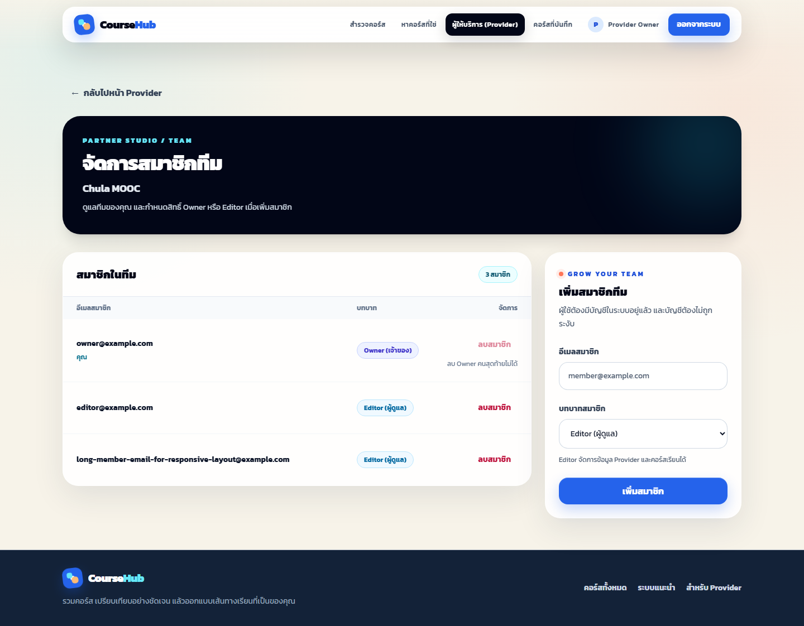
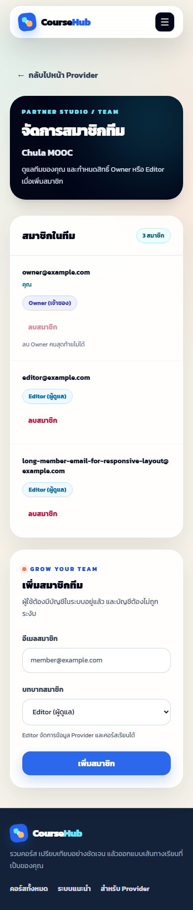

# UC11 — Provider team management frontend

- วันที่ตรวจสอบ: 10 ตุลาคม 2026 (Asia/Bangkok)
- Branch: `supawat_6733800622_01`; PR target: `develop`
- ก่อนเริ่มงาน fetch remote และ fast-forward จาก `d218c07` ไป `2135110` (develop) โดยรักษาประวัติเดิม

## พฤติกรรมที่เพิ่ม

Owner เปิดส่วนจัดการสมาชิกจากการ์ด Provider ได้ ดูอีเมล บทบาท จำนวนสมาชิก และเครื่องหมายบัญชีปัจจุบัน เพิ่มผู้ใช้ที่มีบัญชีด้วยอีเมลพร้อมเลือก Owner/Editor (ค่าเริ่มต้น Editor) และลบด้วย membership ID หลังยืนยันใน dialog รองรับการลบตัวเองเมื่อมี Owner อีกคน แล้วกลับไปโหลดรายการ Provider ใหม่

UI ป้องกันลบ Owner คนสุดท้าย ป้องกันส่งคำขอซ้ำ เก็บค่าฟอร์มเมื่อบันทึกล้มเหลว แสดง field errors และแยกการบันทึกสำเร็จจากการโหลดรายชื่อใหม่ล้มเหลว เมื่อสิทธิ์หมดจะหยุดแสดงข้อมูลสมาชิกและการจัดการ เมื่อออกจากส่วนนี้จะยกเลิกคำขอและไม่ใช้ผลตอบกลับเก่า ใช้ API backend เดิมผ่าน session/CSRF client

## คำสั่งและผลจริง

| Working directory | Command | Result |
| --- | --- | --- |
| `code/frontend` | `npm.cmd test` | 12 files, 94/94 tests ผ่าน |
| `code/frontend` | `npm.cmd run build` | TypeScript และ Vite production build ผ่าน |
| `test/e2e` | `npm.cmd run typecheck` | ผ่าน |
| `test/e2e` | `node node_modules/@playwright/test/cli.js test specs/provider-members-ui.spec.ts` | Chromium desktop/mobile 2/2 ผ่าน |
| `code/frontend` | `npm.cmd run test:e2e -- specs/provider-members.spec.ts specs/provider-members-ui.spec.ts` | Real backend membership + desktop/mobile 3/3 ผ่าน |
| Repository root | `git diff --check` | ผ่าน |

ชุดใหม่มี API contract tests 4 tests และ React behavior tests 26 tests ครอบคลุม Owner/Editor, Provider ทุกสถานะ, trimming/validation, บัญชีไม่พบ/ซ้ำ/ถูกระงับ, field errors, 401/403, list retry/empty, บันทึกสำเร็จแต่ reload ล้มเหลว, duplicate submission, membership ID, last-owner conflict, deletion retry, self-removal, focus trap/restore และผลตอบกลับหลังออกจากหน้า

## Browser และภาพหน้าจอ

Chromium เปิดแอปจริงผ่าน Vite โดยใช้ API fixtures ใน Playwright ไม่ได้เปลี่ยนข้อมูลบัญชีหรือ backend จริง ทดสอบที่ 1440×1000 และ 390×844: เพิ่ม Owner และ Editor, ส่ง CSRF header, ยืนยันลบ membership ID ถูกต้อง, Tab/Shift+Tab/Escape และคืน focus ตรวจ `documentElement.scrollWidth <= innerWidth` ก่อนและหลังการจัดการ ตรวจภาพด้วยตาแล้ว

ภาพจากการรันเทสต์ครั้งต่อไปบันทึกด้วย `test.info().outputPath(...)` ภายใน `test/reports/e2e/` ที่ถูก ignore ไม่เขียนทับภาพหลักฐานด้านล่าง หากต้องการปรับหลักฐานให้คัดลอกจากผลเทสต์ด้วยตนเอง ตรวจหลังรันทั้งแบบ browser-only และผ่าน E2E runner แล้ว `git diff --exit-code -- doc/test-reports/evidence/uc11-members-desktop.png doc/test-reports/evidence/uc11-members-mobile.png` ผ่าน (ภาพที่ commit ไว้ไม่เปลี่ยน)

## Real backend membership E2E

`provider-members.spec.ts` ใช้ `prepareProvider` และ `actors.other` จาก fixture เดิม โดยไม่ intercept API: Owner เพิ่ม Editor ผ่าน UI ได้ `201` และ GET สมาชิกจาก backend พบ membership ที่เพิ่ม บัญชี Editor เห็น Provider แต่ไม่มีปุ่มจัดการสมาชิก และ GET รายชื่อสมาชิกได้ `403` จากนั้น Owner ลบผ่าน dialog ได้ `204` ตรวจ backend เหลือ Owner หนึ่งคน และบัญชี Editor ไม่เห็น Provider หลัง reload

รันผ่านฐานข้อมูล PostgreSQL และ Spring Boot จริงใน Compose project แยก `coursehub-e2e-e1f085a2` ผลรวม 3/3 ผ่าน และ runner ลบ containers/network ของ project หลังจบ รอบแรก daemon ยังไม่ทำงาน จึงเปิด Docker Desktop และรันใหม่จนผ่าน

## ขอบเขตของหลักฐาน

Frontend unit tests และ layout browser tests ใช้ API fixtures ส่วน membership E2E เพิ่มภายหลังตรวจ backend/PostgreSQL จริงตามรายละเอียดข้างต้น ไม่ได้รัน backend integration suite ซ้ำ ไม่มีการเปลี่ยน backend schema หรือ API เปลี่ยนบทบาทสมาชิกเดิม การทดสอบครั้งแรกใน filesystem sandbox ถูกขัดขวางด้วย EPERM ของ dependency Vitest จึงรันใหม่ภายนอก restriction และผ่านตามผลข้างต้น
